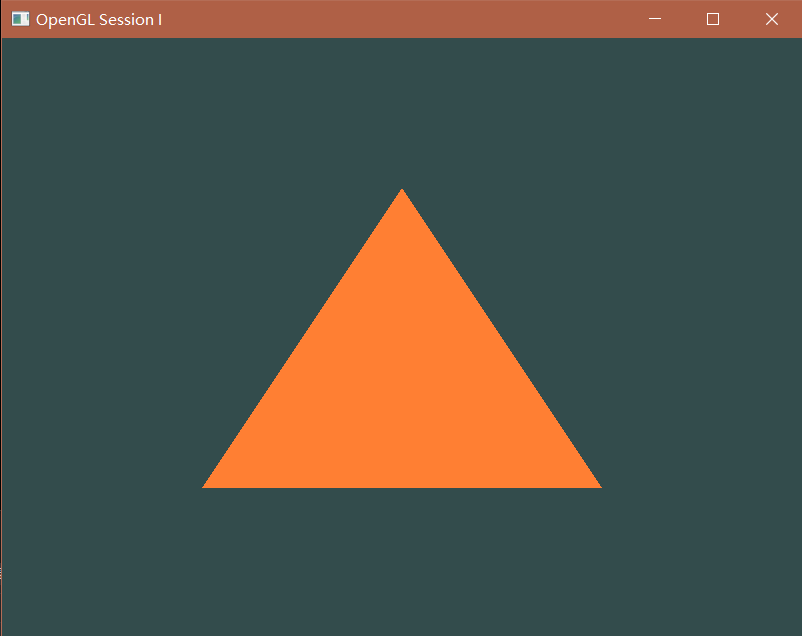
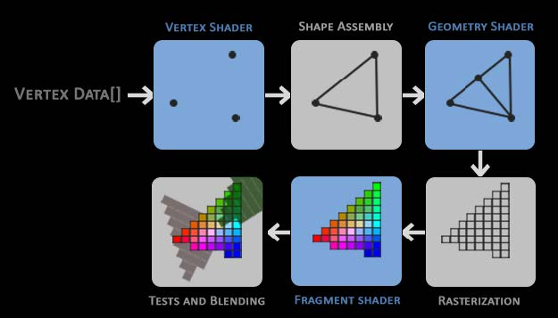
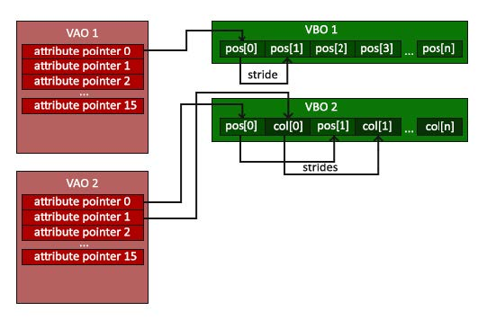
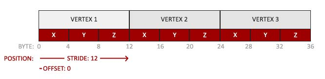
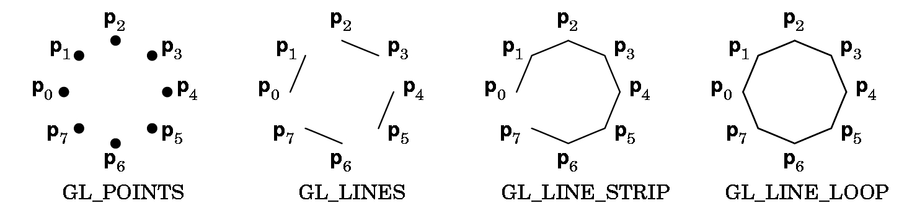
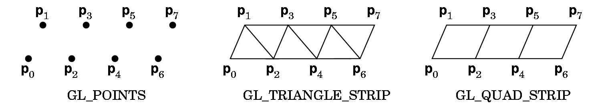
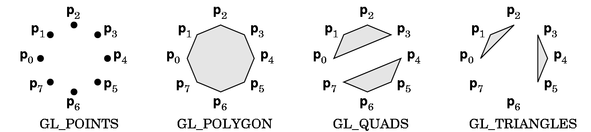

# OpenGL Tutorial
This tutorial introduces the basics of programming with OpenGL for Penn State's CMPSC 458: Fundamentals of Computer Graphics course (Fall 2024). This directory was created by [Addison Petro](https://github.com/Fisik343) during the Fall 2022 semester.

## What is OpenGL?
OpenGL (Open Graphics Library) is a software interface to graphics hardware.
It is a low-level graphics API to specify objects and operations for 3D graphics, which is OS/hardware independent.
## How to get started?
Clone or download the code to your work directory: `$home = path/to/files`
### On Windows
1. Required software: 
    - CMake (with GUI is easiest)
    - Visual Studio
2. Configure the project:
    - Open cmake-gui (already installed on lab machines or install it on your personal computer if you are using that)
    - Set source code to: `$home`
    - Set build the binaries to: `$home/Build`
    - Press "Configure" and specify the generator to the lastest version of Visual Studio on your system (no need to change by default)
    - Press "Configure" again until there are no more red entries
    - Press "Generate"
3. Run the project in Visual Studio:
    - In cmake-gui, press "Open Project" to run the project
    - In Visual Studio, right click on **OpenGL_tutorial_I** and select "Set as StartUp Project"
    - In VS, build the project (you can just click on Local Windows Debugger and it will build it)
        - This takes some time the first time but is much faster after the first time
  
### On Linux/Mac 
1. Required software:
    - CMake
2. Configure the project:
    - `cd $home`
    - `mkdir Build`
    - `cd Build`
    - Run `make -j4`
        - It takes some time
        - You may replace the 4 with the number of cores on your machine
    - From the `$home/Build` directory, run `./OpenGL_tutorial_I` to run the project
    - You can edit the source files with whatever editor you like, though if you want to add more files, you will have to run CMake again (which you can from the command line with `cmake ..` from the `Build` folder and the files will automatically be added if they are in the same locations as the starter code)

## How does the code work?
After you have successfuly compiled the project following our instructions, the **OpenGL_tutorial_I** part will show how to open a new window, display a triangle and has a basic *game loop*. A *game loop* is the while loop which contains the code that runs between every frame.



Now let's dig deeper into the most important parts of the code

### Initialization
In the main function, we firstly initialize and configure **GLFW**.
**GLFW** is a lightweight utility library for OpenGL. It provides simple window and OpenGL context management. Additionally, it provides callback-driven event processing for display, keyboard, mouse, controllers, etc.
```
glfwInit();
```
This initialization function is called near the start of every OpenGL program.

### Create the window
We then create the window by calling the `glfwCreateWindow()` function like this: 
```
GLFWwindow* window = glfwCreateWindow(SCR_WIDTH, SCR_HEIGHT, "OpenGL Session I", NULL, NULL);
```
The parameters of `glfwCreateWindow()` are: width, height, window name, monitor (usually `NULL`) and share (usually `NULL`).

### Build and compile the shader
We will not be covering shaders in much detail right now. We will go back to discuss the vertex and fragment shader in more detail when we get to Project 3: Ray Tracing. For now, what you need to know is that vertex and fragment shaders are required if we want to render to the screen. The shaders we use are written in the shader language GLSL (OpenGL Shading Language). In this tutorial, we only use very simple vertex and fragment shaders.

- Vertex shader
```
#version 330 core
layout (location = 0) in vec3 aPos;

void main()
{
    gl_Position = vec4(aPos.x, aPos.y, aPos.z, 1.0);
}
```
The vertex shader converts each 3D coordinate of a vertex into vec4 of `(x, y, z, w)` where *w* is called perspective division. We will cover this part in matrix transformation lectures. Note that the value *w* is hardcoded as 1.0 for this program.

- Fragment Shader
```
#version 330 core
out vec4 FragColor;

void main()
{
    FragColor = vec4(1.0f, 0.5f, 0.2f, 1.0f);
} 
```
Our fragment shader defines the final color output in vec4 of (red, green, blue, alpha). Note that we are hardcoding the color values here.

### Vertex Input
The OpenGL rendering pipeline is shown below.



1. Vertex data

    First, we define the vertex data. As a tutorial example, we define 3 vertices of a triangle in a float-type array:
    ```
    float vertices[] = {
        -0.5f, -0.5f, 0.0f, // left  
        0.5f, -0.5f, 0.0f, // right 
        0.0f,  0.5f, 0.0f  // top   
    };
    ```
    Every three elements in this array indicates the `(x,y,z)` coordinate of a vertex. Note that all of our z-values are 0.0f for now, indicating that our triangle in the xy-plane with z=0.

2. Creating Vertex Buffer Object (VBO)

    *VBO* (Vertex Buffer Object) sets up a buffer to send data to the GPU.
    The *VBO* is created by setting an unsigned int value to refer to it later:
    ```
    unsigned int VBO; \\Vertex Buffer Object ID
    glGenBuffers(1, &VBO); \\Generate Buffer
    ```
    We then bind an array buffer to our *VBO* and set up the buffer data for our *VBO*:
    ```
    glBindBuffer(GL_ARRAY_BUFFER, VBO); \\Bind Buffer with VBO
    glBufferData(GL_ARRAY_BUFFER, sizeof(vertices), vertices, GL_STATIC_DRAW); \\Send data to the buffer
    ```
    Here `GL_ARRAY_BUFFER` indicates the data type, and `GL_STATIC_DRAW` indicates how the GPU will treat the data. These two parameters will remain unchanged for us.

3. Creating Vertex Array Object (VAO)

    Once we have the buffer set up, we need to tell OpenGL how to interpret it.
    The relationship between *VBO* and *VAO* (Vertex Array Object) is shown below:

    
    
    Similar to *VBO* initialization, we have:
    ```
    unsigned int VAO; \\Vertex Array Object ID
    glGenVertexArrays(1, &VAO); \\Generate Vertex Array
    ```
    Then we bind the vertex array:
    ```
    glBindVertexArray(VAO);
    ```
    *VAO* creates “attribute pointers” which tell OpenGL how to parse the data.
    ```
    glVertexAttribPointer(0, 3, GL_FLOAT, GL_FALSE, 3 * sizeof(float), (void*)0);
    ```
    The parameters of `glVertexAttribPointer()` are:
    - Location
    - Number of Components
    - Type
    - Normalize Data
    - Stride to next element in array
    - Starting Position of element

    Here, `3` indicates that each vertex is composed of 3 float type values. `3 * sizeof(float)` indicates the stride between vertices, which is the memory size of each vertex element. This is important to keep track of since the data for all the vertices are stored in a contiguous memory block. 

    

### Game Loop
The game loop is where we actually run the application.
1. Set background color
    
    - We set the background color with:
    `glClearColor(0.2f, 0.3f, 0.3f, 1.0f);`
     which specifies the red, green, blue, and alpha values.
    
    - Then we clear any previous data in buffer:
    `glClear(GL_COLOR_BUFFER_BIT);`

2. Draw our first triangle

    - We need to define the shaders used to render:
    `glUseProgram(shaderProgram);`
    , which we will skip explaining for now and cover in the next tutorial.
    
    - Specify which data to use:
    `glBindVertexArray(VAO);`
    
    - Draw our triangle:
    `glDrawArrays(GL_TRIANGLES, 0, 3);`
        - Mode: Specifies what kind of primitives to render.
        - Starting index
        - Number of indices to be rendered
        
    In this example, `GL_TRIANGLES` tells the function to draw lines between every three points. It starts from the beginning of VAO and renders 3 vertices.
    Although `GL_TRIANGLES` is the easiest and most commonly used, there are other kinds of primitives, including points, lines, polygons, etc.
    
    
    
    

3. Check and call events and swap the buffers
    ```
    glfwSwapBuffers(window);
    glfwPollEvents();
    ```
    These two functions are called at the end of each loop to swap the buffer and see if any keys were pressed since the last loop iteration.

## Practice
Till now hope you have learned the basic struture of an OpenGL program and got familiar with the basic variables and functions for rendering.

Here are some practice tasks:
- Create a Second Triangle

    You need to add more vertices and change `glDrawArrays()` to load 6 vertices instead of 3

- Create a rectangle by combining the two triangles

    Bonus: you may consider using *EBO* (Element Buffer Objects) which is a better solution that stores only the unique vertices and then specifies the order in which we want to draw these vertices.
    Learn how to use it from <https://learnopengl.com/Getting-started/Hello-Triangle>.
    
- Change the color of the triangles.

    Hint: Think about where the color comes from
    
    Bonus: What if we want to specify different colors for each triangle?

## Acknowledgement
Thanks to <https://learnopengl.com/> for providing fantastic figures and tutorials for beginners.

Thanks to <https://github.com/Polytonic/Glitter> for providing the outline of the tutorial code.
